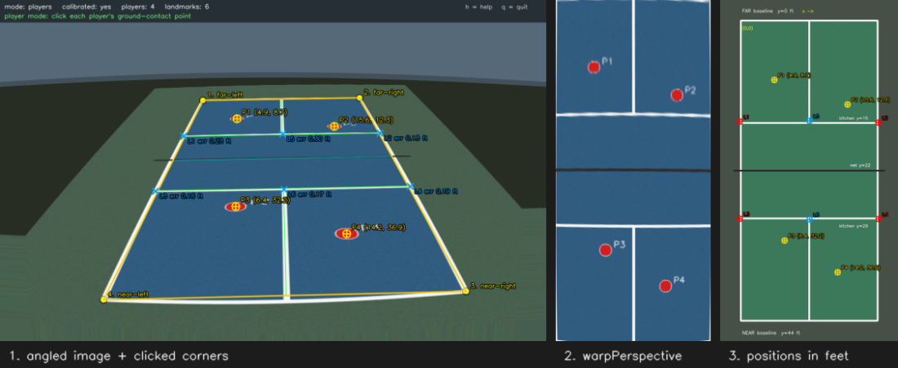
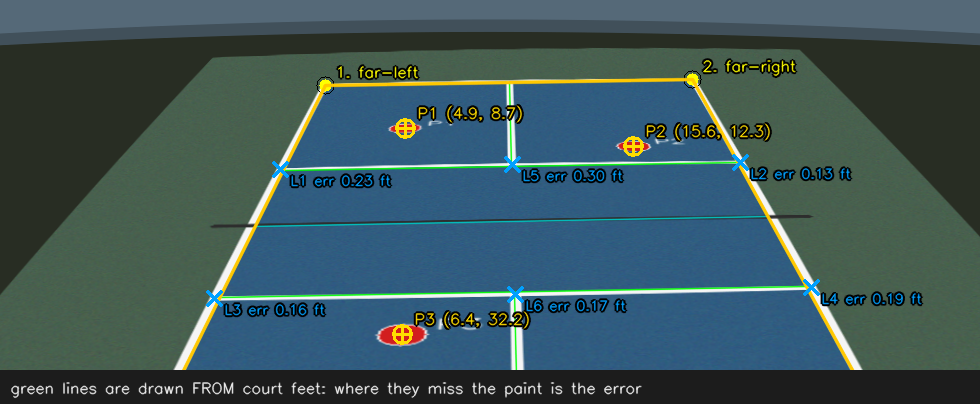
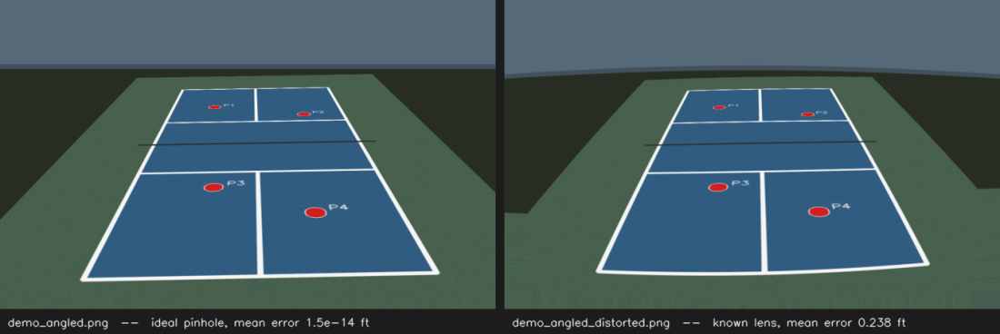

# Pickleball Court Rectifier

Turn an angled photograph of a pickleball court into a top-down view, and map
player positions from the photo into real court coordinates in feet.

Everything is manual and explicit: you click the four court corners, the code
solves one 3×3 homography with `cv2.getPerspectiveTransform`, and every later
click is pushed through that matrix with `cv2.perspectiveTransform`. There is
no detection, no training, and no video — the point is to understand the
geometry, not to hide it.



*Every figure in this README was produced by running the code — regenerate them
with `python docs/make_figures.py`. The image above is the distorted demo court,
so the reported positions carry real error.*

---

## 1. Quick start

Requires Python 3.9 or newer (developed and tested on Python 3.12.10, Windows 11,
OpenCV 4.14.0, NumPy 2.5.3).

### Windows (PowerShell)

```powershell
cd path\to\SkillsAssignment
python -m venv .venv
.\.venv\Scripts\python.exe -m pip install --upgrade pip
.\.venv\Scripts\python.exe -m pip install -r requirements.txt
```

> If `python` is not recognised, Python is not on your PATH. Either reinstall it
> with "Add python.exe to PATH" ticked, or call it by full path, e.g.
> `& "$env:LOCALAPPDATA\Programs\Python\Python312\python.exe" -m venv .venv`.
> After the venv exists you never need the system Python again — just use
> `.\.venv\Scripts\python.exe`.

### macOS / Linux

```bash
cd path/to/SkillsAssignment
python3 -m venv .venv
source .venv/bin/activate
pip install --upgrade pip
pip install -r requirements.txt
```

### Run it

```powershell
# 1. make the synthetic demo courts (10 images: 5 viewpoints, exact + distorted)
.\.venv\Scripts\python.exe generate_demo.py --all

# 2. check the whole pipeline with no windows, against known ground truth
.\.venv\Scripts\python.exe verify_demo.py

# 3. the same check on a lens-distorted image, where errors are REAL
.\.venv\Scripts\python.exe verify_demo.py --image demo\demo_angled_distorted.png

# 4. run the unit tests
.\.venv\Scripts\python.exe -m unittest discover -s tests -v

# 5. the interactive tool
.\.venv\Scripts\python.exe main.py demo\demo_angled_distorted.png

# 6. reuse a saved calibration instead of clicking corners again
.\.venv\Scripts\python.exe main.py demo\demo_angled_distorted.png --load
```

No court photo of your own? You do not need one — see §5.

On macOS/Linux with the venv activated, replace `.\.venv\Scripts\python.exe`
with `python`.

Useful options:

| option | meaning |
| --- | --- |
| `--demo` | use `demo/demo_angled.png`, generating it first if missing |
| `--calibration PATH` | where to read/write the calibration JSON (default `output/calibration.json`) |
| `--load` | load that calibration at startup instead of clicking corners |
| `--out DIR` | output folder for CSVs and images (default `output`) |
| `--ppf 20` | pixels per foot in the rendered top-down views |
| `--max-display 1280x800` | largest window size; larger photos are shown scaled |

---

## 2. Controls

Click **in the image window**, not the terminal.

| input | action |
| --- | --- |
| left click | add a point for the current mode |
| `c` | corner mode — (re)select the four court corners |
| `p` | player mode — click players' ground-contact points |
| `v` | validation mode — click a known landmark, then name it in the terminal |
| `u` | undo the last point of the current mode |
| `r` | reset all points of the current mode |
| `2` | show/hide the rectified top-down window |
| `3` | show/hide the court diagram window |
| `s` | save everything to the output folder |
| `l` | reload the calibration file from disk |
| `h` | print the help block to the terminal |
| `q` or `Esc` | quit |

**Corner order: far-left, far-right, near-right, near-left.** "Far/near" and
"left/right" describe the court *as it appears in your photograph*, going
clockwise around the court on screen — they are not any official end of a real
court. If the camera is behind the near baseline, the far baseline is the one
near the top of the frame. Clicking the corners in the reverse order is
detected and refused, because it would mirror the court.

Validation mode is the one place the terminal is used for input: after each
click you pick the landmark from a numbered menu (or type `x,y` in feet). The
image window is unresponsive while it waits for that line of input.

---

## 3. How it works

### The math, in one page

A pickleball court is **flat**. Any flat surface seen by a pinhole camera is
related to its true top-down shape by a *homography* — a 3×3 matrix `H` acting
on **homogeneous coordinates**:

```
    [ x' ]       [ h00  h01  h02 ] [ u ]
    [ y' ]   =   [ h10  h11  h12 ] [ v ]           X = x' / w'
    [ w' ]       [ h20  h21  h22 ] [ 1 ]           Y = y' / w'
```

`(u, v)` is a pixel in the photo; `(X, Y)` is a position on the court in feet.
The third row is what makes this *perspective* rather than affine: the final
division by `w'` is why equal steps down the court are **not** equal steps in
pixels, and why the far baseline looks shorter than the near one.

`H` has 9 entries but only 8 degrees of freedom, because scaling the whole
matrix does not change `x'/w'` and `y'/w'`. Each point correspondence gives
2 equations, so **4 points are exactly enough** — that is why you click 4
corners and why `cv2.getPerspectiveTransform` takes exactly 4 pairs. (With more
than 4 points you would use `cv2.findHomography`, which least-squares fits them;
this project deliberately stays with the minimal, exactly-determined case.)

The four corners are paired with their known court coordinates:

| click order | label | court coordinate (ft) |
| --- | --- | --- |
| 1 | far-left | (0, 0) |
| 2 | far-right | (20, 0) |
| 3 | near-right | (20, 44) |
| 4 | near-left | (0, 44) |

Because `H` is fitted *through* those four points, they map to those coordinates
with ~1e-14 ft error no matter how badly you clicked. **That is not accuracy.**
It is the fit reproducing its own inputs. Real accuracy is measured at other
landmarks — see §5.

### The three coordinate systems

Most of the code's care goes into not confusing these:

1. **Image pixels** — the original photo's pixel grid. All clicks are converted
   back to this grid before any geometry happens.
2. **Court feet** — the physical answer. Far-left corner is `(0, 0)`, `x` grows
   toward the right sideline (0…20 ft), `y` grows toward the near baseline
   (0…44 ft). This is what gets reported and exported.
3. **Output pixels** — pixels of a rendered top-down image, which are just
   court feet × a pixels-per-foot scale (plus a margin, for the diagram).

Rendering resolution never touches a reported coordinate: `--ppf 8` and
`--ppf 40` produce different-sized images and identical feet. There is a unit
test for exactly that (`test_changing_ppf_does_not_change_court_coordinates`).

The window also scales: a 4000×3000 photo is shown at 1067×800, so a click at
display `(x, y)` is original pixel `(x / 0.267, y / 0.267)`. Skipping that
division is the classic silent bug — it shifts every position by a few feet and
still *looks* plausible. `DisplayScaler` owns the conversion and is tested both
ways.

### Why only ground contact points

The homography maps the **court plane**. A point at the player's feet lies on
that plane, so it maps correctly. A point on their head does not: the camera ray
through the head pierces the ground somewhere *behind* the player, so you get a
position that is systematically too far from the camera — often by several feet.
The same applies to an airborne ball. Always click the point between the feet.

### What each OpenCV call does here

| call | role |
| --- | --- |
| `cv2.getPerspectiveTransform(src, dst)` | solves the 3×3 `H` from exactly 4 point pairs; `src[i]` must correspond to `dst[i]`, hence the fixed click order |
| `cv2.perspectiveTransform(pts, H)` | maps *points*; does the homogeneous divide by `w'` for you; wants an `(N, 1, 2)` array |
| `cv2.warpPerspective(img, M, size)` | maps the *whole image*; `M` must go from source pixels to **output** pixels, so we compose `scale @ H` |
| `cv2.setMouseCallback(win, fn)` | delivers clicks in *window* coordinates — convert them yourself |
| `cv2.imshow` / `cv2.waitKey` | display and the keyboard loop; `waitKey` is what actually pumps window events |

---

## 4. Project layout

```
main.py             CLI, OpenCV windows, mouse and keyboard handling
perspective.py      all the geometry: homography, coordinates, calibration I/O, drawing
generate_demo.py    builds the synthetic courts: 5 viewpoints, optional known lens
                    distortion, and exact ground truth for every landmark
verify_demo.py      runs the entire workflow headlessly and checks it against that
                    ground truth; demands zero error on exact images, reports real
                    error on distorted ones
tests/test_geometry.py   54 unit tests (standard-library unittest, no extra packages)
docs/make_figures.py     regenerates the README images by running the project
docs/images/             the figures this README links to (committed)
requirements.txt
demo/               generated, not committed: demo_topdown.png,
                    demo_<view>[_distorted].png and a matching
                    *_ground_truth.json for each
output/             generated, not committed: per image, calibration.json,
                    players.csv, validation.csv, validation_summary.json,
                    rectified.png, court_diagram.png, annotated_original.png
```

Fresh clone? `pip install -r requirements.txt` then
`python generate_demo.py --all` recreates everything that is not committed.

`perspective.py` has no windows and no I/O beyond JSON, which is why the whole
pipeline can be verified on a machine with no display.

### What gets saved (`s`)

| file | contents |
| --- | --- |
| `calibration.json` | image dimensions, the 4 corner pixels, court dimensions, the 3×3 homography, corner order, timestamp |
| `players.csv` | label, image pixels, court feet, out-of-court flag |
| `validation.csv` | landmark, image pixels, measured feet, true feet, error in feet |
| `validation_summary.json` | n, mean, RMSE, max, median error |
| `rectified.png` | `warpPerspective` output, 400×880 px at 20 px/ft (true 20:44) |
| `court_diagram.png` | the clean diagram with player markers |
| `annotated_original.png` | the photo with the overlay, for your report |



Reloading a calibration (`--load` or `l`) checks the image dimensions match.
**That check is a guard rail, not a guarantee.** Two photos of the same size
taken from different camera positions both pass it, and only one of them is
actually calibrated. The camera position, orientation, zoom and crop must all
match. Visually confirm it: when a calibration is loaded, the tool draws the
kitchen lines, centerlines and net back onto the photo in green — if those
green lines do not sit on the painted lines, the calibration does not belong to
that photo.

Out-of-court positions are **reported, never clamped**: a click outside the
lines gives a coordinate like `(23.98, 46.99)` flagged `OUT`. On the diagram, a
marker too far out to fit on the canvas is drawn as a triangle at the edge and
labelled `OFF-DIAGRAM` — only the *drawing* is pulled in, the printed and
exported coordinate stays true.

---

## 5. Measuring accuracy (validation mode)

Press `v`, click a court landmark you can identify precisely, then choose what
it is from the terminal menu. The tool reports the Euclidean error in feet for
each landmark, plus mean and RMSE, and writes them to `validation.csv`.

Use **at least five** landmarks that are *not* the four calibration corners —
the built-in menu offers ten: kitchen-line/sideline intersections, kitchen-line
/centerline intersections, baseline/centerline intersections, and net-line
/sideline points. The four corners are excluded by construction: they fit
exactly by definition, so quoting them as evidence of accuracy would be
circular.

A useful habit: report mean **and** RMSE. RMSE is never smaller than the mean
and grows faster when one landmark is badly off, so a large gap between them
tells you a single click was bad rather than the whole calibration being poor.

### No court photo? Use the distorted synthetic images

`generate_demo.py` can produce a court that behaves like a real camera saw it.
Three levels, each stronger evidence than the last:

| level | command | what you learn |
| --- | --- | --- |
| **exact** | `generate_demo.py` | proves the code is right; errors ~1e-14 ft, which is arithmetic, not accuracy |
| **distorted** | `generate_demo.py --distortion` | a *known* radial lens distortion bends the court lines. One homography cannot fit a curved image, so validation errors become real — tenths of a foot |
| **distorted + shaky clicks** | `verify_demo.py --click-noise 3` | adds Gaussian noise to the corner clicks, simulating an imprecise hand |

```powershell
.\.venv\Scripts\python.exe generate_demo.py --all           # 5 views x exact/distorted
.\.venv\Scripts\python.exe verify_demo.py --image demo\demo_angled_distorted.png
.\.venv\Scripts\python.exe verify_demo.py --click-noise 3   # exact image, sloppy clicks
.\.venv\Scripts\python.exe main.py demo\demo_angled_distorted.png   # then press v
```



Views: `default`, `low` (camera low behind the baseline), `high` (on a pole),
`corner` (off to one side), `oblique` (a hard angle). `--distortion K1` takes a
coefficient: positive bends lines like a pincushion, negative like the barrel
distortion of a phone ultra-wide. Strong negative values fold the image
mathematically, and the script says so rather than inventing ground truth.

`verify_demo.py` switches mode by itself: on an exact image it *demands*
~zero error and fails otherwise; on a distorted image or with click noise it
reports mean/RMSE instead, while still enforcing the structural checks
(round trips, save/reload, rejection of bad input).

The most useful thing in that output is what happens to the corner self-check.
With `--click-noise 3`, every corner click is about 3 px wrong, and the four
corners *still* map to (0,0), (20,0), (20,44), (0,44) to within 1e-6 ft — while
independent landmarks are off by a quarter of a foot. A fit always reproduces
its own inputs. That is the whole reason validation mode exists.

### Three kinds of accuracy claim

They are not interchangeable, and the project keeps them apart:

| | exact synthetic | distorted synthetic | real photograph |
| --- | --- | --- | --- |
| image from | a known homography | a known homography + known lens | a camera |
| "clicks" from | exact ground truth | exact, or simulated noise | your hand on a mouse |
| error measures | floating-point arithmetic | distortion the model cannot express | that, plus unknown lens, flatness, your clicking |
| magnitude seen here | ~1e-14 ft | 0.19–0.38 ft mean (see below) | **unmeasured — you would have to do it** |
| proves | the code is correct | you can measure and explain error | how usable it is in the field |

Measured by `verify_demo.py` across the ten generated demo images, at ten
independent landmarks each, with `--distortion 0.16`:

| view | exact mean error | distorted mean error | distorted RMSE | distorted max |
| --- | --- | --- | --- | --- |
| default | 1.5e-14 ft | 0.238 ft | 0.269 ft | 0.562 ft |
| low | 1.9e-14 ft | 0.189 ft | 0.212 ft | 0.459 ft |
| high | 5.1e-15 ft | 0.366 ft | 0.406 ft | 0.755 ft |
| corner | 8.8e-15 ft | 0.382 ft | 0.399 ft | 0.599 ft |
| oblique | 7.9e-15 ft | 0.380 ft | 0.414 ft | 0.789 ft |

Worth explaining in your write-up: the `high` view — the one closest to
overhead, which *looks* like it should be easiest — has roughly twice the
distorted error of the `low` view. The reason is not the angle but the framing:
the high view's court fills the frame right out to the corners, where radial
distortion is strongest, while the low view's court is bunched near the centre.
Where the court sits in the frame matters as much as where the camera stands.

**No accuracy number for a real photograph appears anywhere in this repository,
because none has been measured.** If you do shoot one, fill this in:

| | your measurement |
| --- | --- |
| photo used | _(filename, camera, roughly where you stood)_ |
| landmarks used (≥5) | |
| mean error (ft) | |
| RMSE (ft) | |
| max error (ft) | |
| what you think dominated the error | |

---

## 6. Verification performed

Run these three commands and you reproduce everything claimed here.

| check | command | result |
| --- | --- | --- |
| 54 unit tests (geometry, validation, scaling, persistence, statistics, distortion) | `python -m unittest discover -s tests -v` | all pass |
| end-to-end synthetic workflow, 8 steps | `python verify_demo.py` | all pass |
| the same on all 10 demo variants | `python verify_demo.py --image demo\<name>.png` | all pass; the 5 distorted ones report 0.19–0.38 ft mean error |
| demo image generation | `python generate_demo.py --all` | writes 21 files |

What the automated checks cover:

- known points map to expected court coordinates under a synthetic transform;
- image → court → image round trips on 500 random points (max error < 1e-7 px);
- clicks in a half-size window map back to the correct original pixel, and the
  test also asserts that *forgetting* the conversion is detectably wrong;
- invalid corner selections are rejected: duplicate, near-duplicate, collinear,
  near-zero-area, self-intersecting (bow-tie), non-convex, reversed order, and
  the wrong number of points;
- saving and reloading a calibration reproduces the matrix bit-for-bit and maps
  100 random points identically; corrupt JSON, missing keys, a singular matrix
  and a mismatched image size are all rejected;
- out-of-court coordinates survive a round trip and are flagged, not clamped;
- the rectified image is 20:44 and the reported feet are independent of `--ppf`;
- the lens-distortion model inverts to < 1e-9 px for positive and negative
  coefficients, is exactly zero at the image centre, grows with radius, and
  refuses to invent ground truth where a strong barrel coefficient folds the
  image (a bug found and fixed during development: the earlier fixed-point
  iteration diverged silently there);
- every built-in camera viewpoint passes corner validation, the exact variants
  fit to < 1e-6 ft, and the distorted variants produce real but plausible error
  while their corner residual stays ~0.

Interactive behaviour was exercised by driving the application object with
simulated `cv2.EVENT_LBUTTONDOWN` events (corner clicks in a half-size window,
player clicks, an out-of-court click, bad-selection rejection, undo/reset, save,
reload, and the wrong-size reload refusal), and the three windows were confirmed
to open and render on this machine.

**Not verified automatically, and worth checking when you run it:** that real
mouse clicks land where you expect, that the keyboard shortcuts feel right, and
that window behaviour is sane on *your* OS and display scaling. Those need a
human at the machine.

One number worth noticing from the simulated run: clicking the corners in a
half-size window (so each click is rounded to the nearest 2 original pixels)
moved the mapped player positions by 0.02–0.17 ft. That is the size of the error
a small clicking imprecision produces — a preview of what you will measure on a
real photo.

---

## 7. Learning objectives

Measurable, in the sense that each has a check you can actually perform.

1. **Compute a perspective transformation from four point correspondences.**
   *Evidence:* given the four corner pixels, state which court coordinate each
   pairs with, and explain from the 8-degrees-of-freedom argument why four
   points are exactly enough and why a fifth would need `findHomography`
   instead. Verify by predicting the court coordinate of the net centre before
   clicking it, then checking within 1 ft.
2. **Apply a transformation to both an image and individual coordinates, and
   keep the coordinate systems straight.** *Evidence:* explain why
   `warpPerspective` needs `scale @ H` rather than `H`, and predict which pixel
   of `rectified.png` corresponds to court `(10, 22)` at 20 px/ft before
   checking (answer: 200, 440).
3. **Evaluate accuracy on independent landmarks.** *Evidence:* measure ≥5
   non-corner landmarks on `demo_angled_distorted.png` (or a real photo),
   report mean and RMSE in feet, and explain in one sentence why the four
   calibration corners cannot be part of that measurement. Cross-check your
   clicked result against `verify_demo.py`'s figure for the same image — the
   gap between them is your clicking precision.
4. **Persist and safely reuse calibration data.** *Evidence:* calibrate, save,
   quit, relaunch with `--load`, and map the same player position to within
   0.01 ft of the earlier value; then state the failure case the dimension check
   does *not* catch.
5. **Explain the flat-plane assumption and its consequences.** *Evidence:* click
   the same player's feet and then their head, record both coordinates, and
   explain the direction and rough size of the discrepancy.

---

## 8. Official OpenCV resources

Both verified reachable on 2026-09-22.

### [Geometric Transformations of Images](https://docs.opencv.org/4.x/da/d6e/tutorial_py_geometric_transformations.html) (OpenCV-Python tutorial)

**Teaches:** the practical mechanics this project is built on — that a
perspective transform needs a 3×3 matrix and four point correspondences, that
`cv2.getPerspectiveTransform` produces it and `cv2.warpPerspective` applies it
to an image, and that straight lines stay straight. It sits alongside the
affine/rotation/scaling transforms, which is useful for seeing what the
perspective case adds.
**Limitations:** it is a recipe, not an explanation — it does not derive the
homography, does not discuss homogeneous coordinates or the division by `w`,
and warps only images, never individual points. It says nothing about choosing
an output scale with physical meaning (our pixels-per-foot), about accuracy, or
about where the four points should come from. Its example uses a hard-coded
sudoku puzzle; every judgment call you face here is outside its scope.

### [Basic concepts of the homography explained with code](https://docs.opencv.org/4.x/d9/dab/tutorial_homography.html) (OpenCV main tutorial)

**Teaches:** the theory behind the matrix — why a *planar* scene is related to
its image by a homography, how that connects to camera pose and the intrinsic
matrix, and worked demos including warping a source image to a desired
perspective view. This is the page that explains *why* the four-corner trick
works, and why it only works for points on the plane.
**Limitations:** considerably heavier than this project needs; much of it is
about camera calibration, pose estimation and homography decomposition, and its
examples lean on a chessboard pattern with known intrinsics, which you do not
have for a phone photo of a court. It is C++-first (Python is provided but
secondary), and it does not address interactive point selection or error
reporting in physical units.

### Also useful

- [Mouse as a Paint-Brush](https://docs.opencv.org/4.x/db/d5b/tutorial_py_mouse_handling.html) —
  the `cv2.setMouseCallback` pattern used in `main.py`. *Limitation:* it draws
  directly at the event's pixel and never resizes the window, so it never
  raises the display-scaling problem that this project has to solve.
- [Geometric Image Transformations](https://docs.opencv.org/4.x/da/d54/group__imgproc__transform.html) —
  the API reference with the exact formulas and argument types for
  `getPerspectiveTransform`, `warpPerspective` and friends. *Limitation:*
  reference material only, with no worked context.

---

## 9. Known limitations

- **Lens distortion.** The homography assumes a perfect pinhole camera. Real
  lenses — especially phone ultra-wide and action cameras — bow straight lines,
  most visibly near the frame edges, which is exactly where the court corners
  usually are. Correcting it needs a separate camera calibration
  (`cv2.calibrateCamera` with a chessboard) and `cv2.undistort` before this
  workflow. Not done here. Symptom: corner errors near the frame edge are much
  larger than errors near the centre. You can watch this happen: the same court,
  same corners, with and without a known lens, goes from ~1e-14 ft to 0.24 ft
  mean error (`demo_angled.png` vs `demo_angled_distorted.png`).
- **Corner clicking precision.** With only four points the fit is exactly
  determined, so every pixel of click error goes straight into the result — no
  averaging absorbs it. A blurry, shadowed or occluded corner is the single
  biggest error source in practice. Zoom your photo before clicking, and if a
  corner is guessed, say so in your write-up.
- **Occlusion.** A player, net post, bench or shadow covering a corner forces
  you to estimate it. The same applies to landmarks you are validating against:
  a landmark you cannot see precisely produces an error that says more about
  your click than about the calibration.
- **The flat-court assumption.** Only points on the court plane map correctly.
  Heads, raised paddles, airborne balls and anyone standing on a step or a kerb
  are mapped as if their ray hit the ground, which places them too far from the
  camera. Outdoor courts also drain — a slope of a few inches over 44 ft is
  normal and shows up as a small systematic error at the far end.
- **Extreme viewing angles.** A very low camera makes the far baseline compress
  into a few pixels; a one-pixel corner error there costs far more feet than the
  same error near the camera. Errors grow with distance from the camera.
- **One image, one calibration.** Move or zoom the camera and the calibration is
  void. The dimension check cannot detect that; only the reprojected green lines
  can.
- **No detection of anything.** Corners and players are clicked by a human, by
  design. There is no tracking, no video, and no identity across frames.

---

## 10. Recording your demonstration

A checklist for a short screen recording (about 4–6 minutes). Record your
terminal and the OpenCV windows together, and narrate as you go.

- [ ] Show the repository contents and open `perspective.py` briefly — point out
      that the geometry is separate from the GUI.
- [ ] Show the venv activation and `pip install -r requirements.txt`
      (or that it is already installed).
- [ ] Run `python -m unittest discover -s tests -v` and let the 54 passes scroll.
- [ ] Run `python verify_demo.py` and read the RESULT line aloud, saying
      explicitly that this is synthetic verification, not real accuracy.
- [ ] Run `python verify_demo.py --image demo\demo_angled_distorted.png` and
      contrast the two: same code, same corners, ~1e-14 ft against ~0.24 ft,
      because this image came through a lens.
- [ ] Optionally run `python verify_demo.py --click-noise 3` and point out that
      the corner residual is *still* ~zero while the landmarks are a quarter of
      a foot out — the reason validation mode exists.
- [ ] Launch `python main.py demo\demo_angled_distorted.png` (or your own photo
      if you have one). Say the image size and the window scale the terminal
      prints.
- [ ] Deliberately mis-click one corner twice in the same place (or in reverse
      order) to show the rejection message, then press `r`.
- [ ] Click the four corners correctly, in order, naming each one aloud.
- [ ] Point out the green reprojected kitchen/centerlines/net landing on the
      painted lines — the visual proof the calibration is right.
- [ ] Press `2` and `3` to show the rectified view and the diagram next to the
      photo.
- [ ] Click 2–4 players' feet; read one court coordinate aloud and sanity-check
      it against the diagram ("15.5 ft across, 12 ft from the far baseline —
      yes, that's the right service box").
- [ ] Click one player's head as a contrast and say how far off it lands and why.
- [ ] Click one point outside the sideline to show it is flagged `OUT`, not
      clamped.
- [ ] Press `v` and validate at least five landmarks; read the mean and RMSE.
- [ ] Press `s`, then show the output folder and open `players.csv` and
      `validation.csv`.
- [ ] Quit, then relaunch with `--load` and show that the calibration returns
      with no corner clicking, and that a player click gives the same
      coordinates as before.
- [ ] Close with one sentence on the biggest error source you observed.

## 11. Suggested screenshots

Numbers 1, 3, 4 and 5 already exist in `docs/images/` (regenerate with
`python docs/make_figures.py`). The rest come from your own session — a
screenshot of *you* running it is the evidence, not a rendered figure.

| # | screenshot | caption to write under it |
| --- | --- | --- |
| 1 | The angled photo with the four labelled corners and the yellow quad | "The only four points the calibration uses. The labels show the required click order; each is paired with a known court coordinate." |
| 2 | A rejected selection with the terminal message visible | "Bad selections are refused before they become a silently wrong homography — here a self-intersecting quadrilateral." |
| 3 | The photo with the green reprojected kitchen lines, centerlines and net | "Lines drawn from court feet back into the photo. They were never clicked; that they land on the paint is the visual check that `H` is right." |
| 4 | The rectified top-down view beside the original | "`warpPerspective` output at 20 px/ft, 400×880 px — the true 20:44 court ratio. The converging sidelines are now parallel." |
| 5 | The court diagram with player markers and coordinates | "Player ground positions in feet on a clean diagram. Kitchen lines at y=15 and y=29, net at y=22." |
| 6 | The terminal during validation mode with the running mean/RMSE | "Accuracy measured at landmarks the homography was not fitted to — the only numbers that mean anything." |
| 7 | `players.csv` / `validation.csv` open in a spreadsheet | "Exports: image pixels, court feet, out-of-court flag, and per-landmark error." |
| 8 | The terminal after relaunching with `--load` | "Calibration reloaded from JSON: no corner clicking, identical matrix." |
| 9 | `verify_demo.py` output | "Synthetic end-to-end check against known ground truth. ~1e-14 ft confirms the code, and says nothing about a real photo." |
| 10 | `demo_angled.png` and `demo_angled_distorted.png` side by side | "Identical geometry; the right one came through a known lens. Its court lines are curved, which no single homography can straighten." |
| 11 | The two `verify_demo.py` RESULT blocks for those images | "Same code, same corners: 1e-14 ft against 0.24 ft mean. The difference is entirely the lens." |

## 12. Reflection prompts

Answer these after you have actually used the tool — they are for you to fill
in, and nothing here is pre-answered.

1. Before running validation mode on `demo_angled_distorted.png`, write down the
   error you *expect* in feet. Then measure it. Which way were you wrong, and
   what does that tell you about your intuition for perspective?
2. Where on the court were your errors largest — near the camera or far from it?
   Explain the pattern using the division by `w'`.
3. Recalibrate the same image a second time, clicking as carefully as you can.
   How much did a player's mapped position move between the two calibrations?
   Is that below or above the accuracy you would need to answer a real question
   like "was that player inside the kitchen?"
4. You clicked a player's head as well as their feet. How large was the
   discrepancy, and in which direction? Would that error grow or shrink if the
   camera were mounted higher?
5. What would break first if you pointed this at a video instead of a still —
   and what would you have to add?
6. If you had to get error below 0.25 ft, what would you change first: better
   corner clicks, lens undistortion, more points with `findHomography`, or a
   different camera position? Justify the ranking.
7. Run validation on `demo_high_distorted.png` and `demo_low_distorted.png`. The
   high, more overhead view is the *less* accurate one. Why? (Look at where the
   court sits in each frame, not at the camera angle.) What does that imply
   about where you would stand to photograph a real court?
8. `--click-noise 3` leaves the corner residual at ~1e-6 ft while landmarks move
   a quarter of a foot. Explain to someone who has not read this code why a
   model fitting its calibration points perfectly tells you nothing.
9. Which part of the code took longest to understand? Write the one-sentence
   explanation you wish had been there when you started.

---

## 13. Publishing this yourself

Not done for you — no repository has been created and no one has been contacted.

```powershell
git init
git add .
git commit -m "Pickleball court rectifier: perspective mapping learn-a-skill project"
gh repo create pickleball-court-rectifier --public --source=. --push
# or, without the GitHub CLI: create an empty repo on github.com, then
#   git remote add origin https://github.com/<you>/pickleball-court-rectifier.git
#   git branch -M main
#   git push -u origin main
```

Before pushing: check that photos of identifiable people are yours to publish,
and that `output/` and `.venv/` are ignored (a `.gitignore` is included). The
`demo/` files are reproducible from `generate_demo.py`, so committing them is
optional. Share the repository URL with your instructor yourself, along with
your recording and your completed reflection.

---

## 14. GenAI disclosure (draft — edit to match what you actually did)

> **Draft for you to verify and adjust. It describes what the assistant
> produced; only you can describe what you did.**

This project's code and documentation were generated by Claude (Anthropic's
Claude Opus 5) in Claude Code, from a written specification I provided that
listed the required functionality, scope limits, file structure and
verification criteria.

**Generated by the AI assistant:**

- `perspective.py`, `main.py`, `generate_demo.py`, `verify_demo.py`,
  `tests/test_geometry.py`, `requirements.txt`, `.gitignore`, and this
  `README.md`, including all code comments;
- the synthetic demo courts — five camera viewpoints, the radial lens
  distortion model, and the ground-truth data for all of them;
- the learning objectives, the demonstration checklist, the screenshot
  captions and the reflection prompts listed above (as prompts for me to
  answer, not as answers).

**Run by the assistant in its environment during development:** installing
Python 3.12 and the dependencies, generating the demo images, the 54 unit
tests, `verify_demo.py` on all ten demo variants, simulated mouse-event tests
of the application logic, and a brief check that the OpenCV windows open. Every
number quoted in this README comes from those runs; the per-view error table in
§5 is `verify_demo.py` output on the synthetic images, not a real-court
measurement.

**Not done by the AI, and mine to do:** _(edit this list to match reality)_

- running the tool interactively with real mouse clicks;
- photographing a real court and calibrating it, if I choose to;
- measuring and reporting accuracy on that photo;
- the reflection answers, the recorded demonstration, and publishing the
  repository;
- reviewing and verifying the generated code before submitting it.

**Verification I performed myself:** _(fill in — e.g. which files you read line
by line, which behaviour you tested, anything you changed or corrected, and
anything you found wrong.)_

**Time spent:** _(fill in your own.)_

No accuracy figure for a real photograph appears in this repository unless you
measured it and wrote it in.
